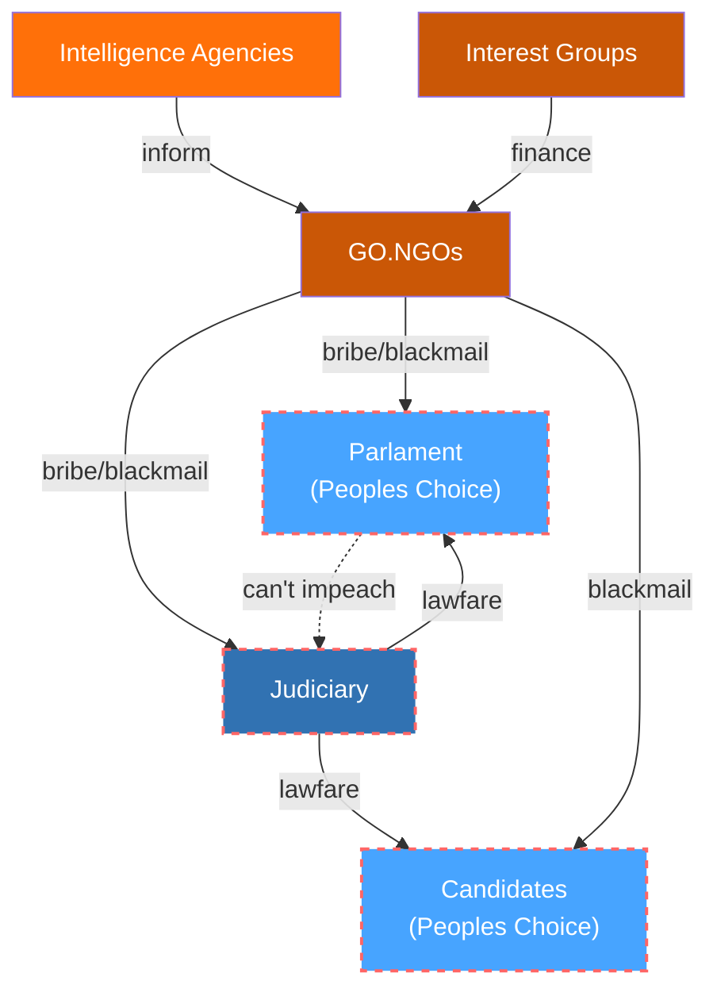

asdf


```mermaid
flowchart TB
    interest[Interest Groups]
    intel[Intelligence Agencies]
    gongo[GO.NGOs]
	houses["Parlament 
	(Peoples Choice)"]
	judiciary[Judiciary]
	pool["Candidates 
	(Peoples Choice)"]

	intel -- inform --> gongo
	interest -- finance --> gongo

	gongo -- bribe/blackmail --> houses
	gongo -- bribe/blackmail --> judiciary
	judiciary -- lawfare --> houses
	houses -. can't impeach .-> judiciary

	judiciary -- lawfare --> pool
	gongo -- blackmail --> pool

	style judiciary fill:#3172b2;
	classDef indirect fill:#ca5706, color:white;
	classDef bad fill:#ff7009, color: white;
	classDef corrupted fill:#47a4ff, color:white, stroke:#f66,stroke-width:2px,stroke-dasharray: 5 5;
	
	class houses corrupted;
	class pool corrupted;
	class intel bad;
	class gongo indirect;
	class interest indirect;
	class judiciary corrupted;


```
	
	
```

asdf
