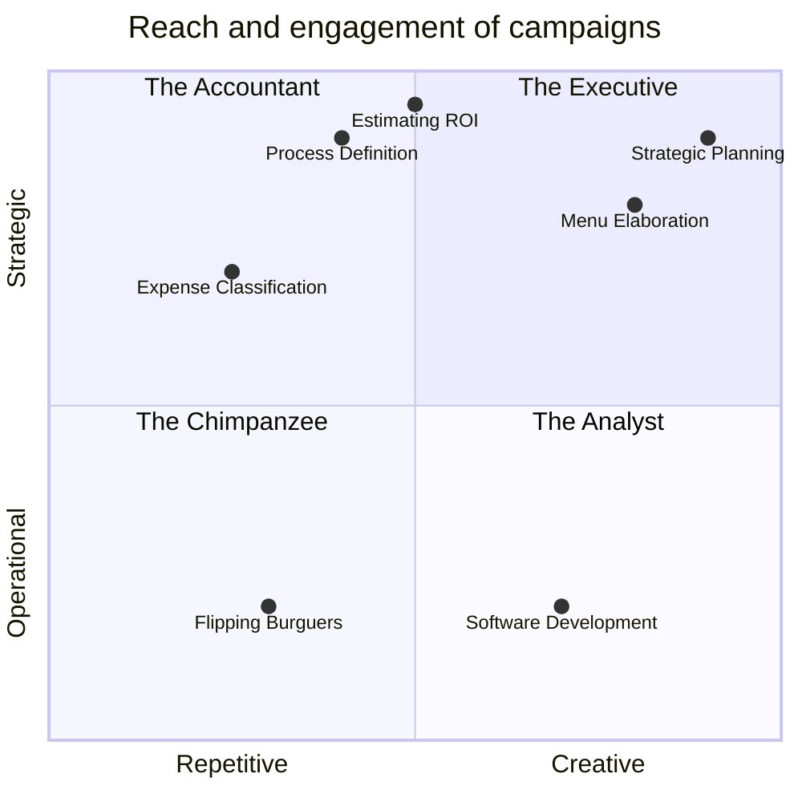

Repetitive:  transcriptable process
Creative: hard to map detailed processes - rendered at runtime - they have to be more abstract and generic with wider variety of outputs
Operational: simple decisions (local information/context, few pre-determined branches, low a priori knowledge)
Strategic: complex decisions (global information/context, less constrained, infinite branches)

More executive activities: decision density
- Bigger a priori knowledge. More a priori information and knowledge (implict and explicit) required
- Bigger context window (more global information vs local information)
- More degrees of freedom (self impose objectives and contraints)
- More impactfull

